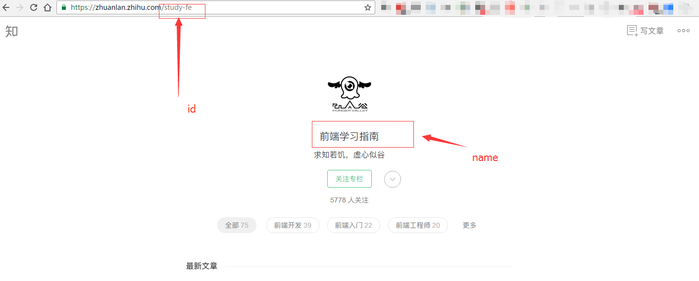

#使用说明

本程序可以实时抓取知乎专栏制成RSS订阅源
首先安装依赖库
```
yarn install
```
安装完成之后，查看你想要订阅的知乎专栏信息

配置config.json,注意输出到特定的路径下,在服务器上以便于服务器抓取

最后执行
```
node index
```
增加守护进程,防止程序挂掉
```
pm2 start index.js --name=zhihuzhuanlan --wacth
```
最后起一个静态服务器和`chrome`插件`Shoyu RSS/Atom Feed Preview`([下载地址](https://chrome.google.com/webstore/detail/shoyu-rssatom-feed-previe/ilicaedjojicckapfpfdoakbehjpfkah?utm_source=chrome-app-launcher-info-dialog))，就可以查看你的RSS是否抓取正确。

**注：最好在vps中定时执行此任务**